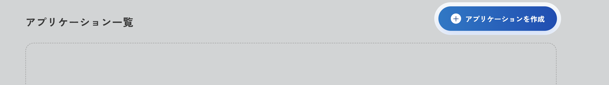
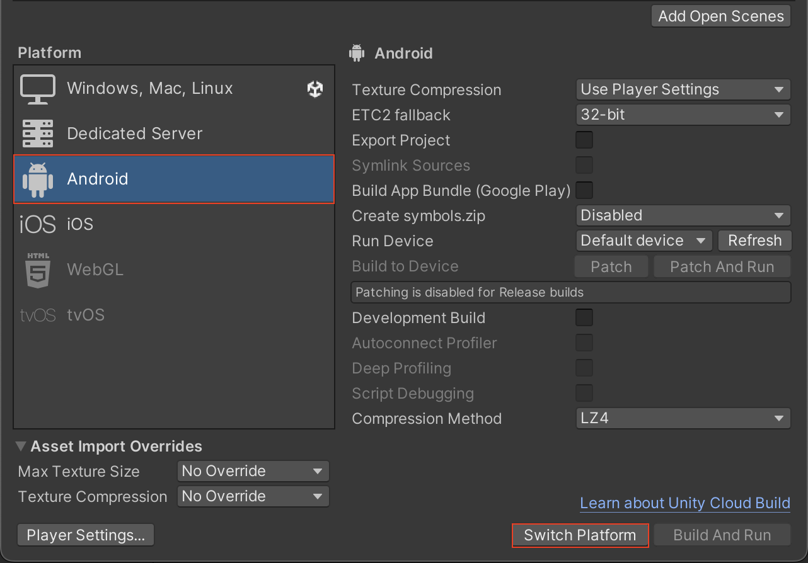
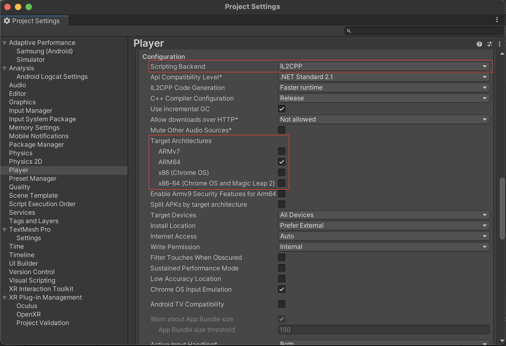
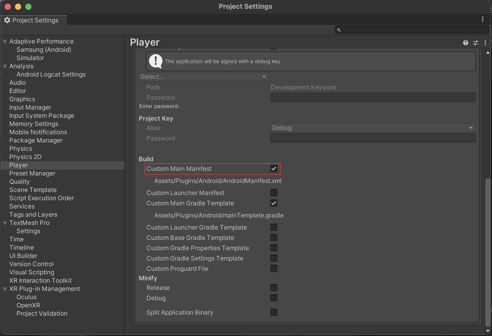
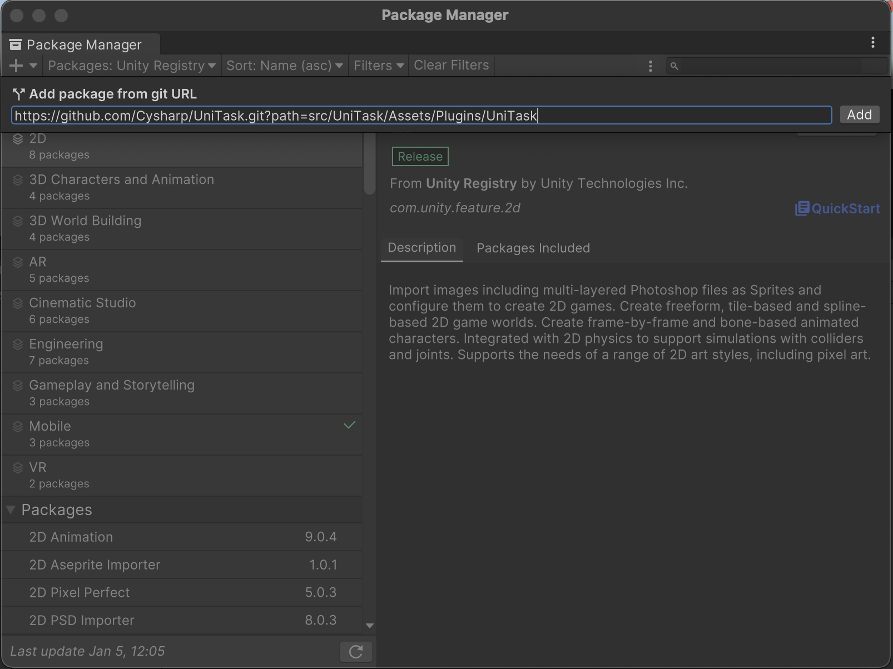
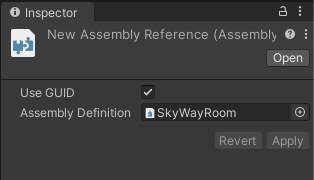
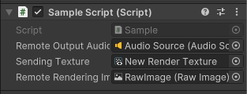
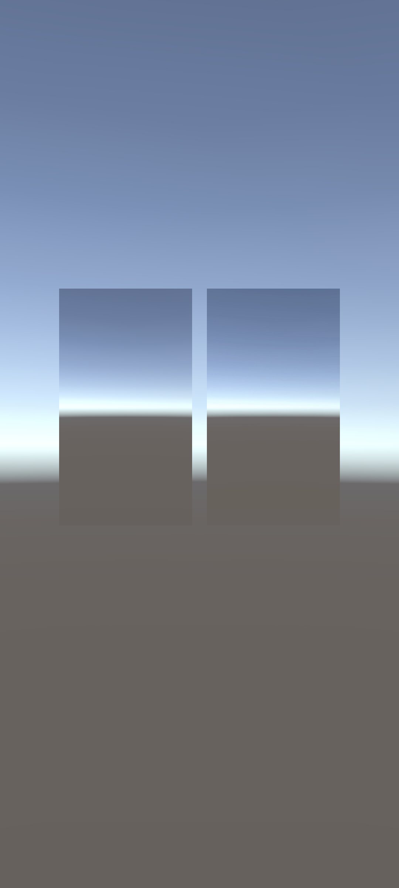

# クイックスタート

- **注: Android以外のプラットフォームでは動作しません。**

SkyWay のメディア通信を体験できるシンプルなサンプルアプリケーションを作成します。

ここでは、デバイスのマイク音源とテクスチャを SFU サーバーに送信し、それぞれを自分が受信して音声の再生と映像の描画するというアプリケーションを作ります。

## 開発環境
- Unity: 2022.3.2f1
- Android 8.0 Pie(API Level 26)以降

## アプリケーション ID とシークレットキーを取得する

※SkyWay への登録がまだの方は[こちら](https://console.skyway.ntt.com/login/)から

SkyWay コンソールへログインし、以下の 3 つを行います。
1. 「アプリケーションを作成」ボタンを押す

2. アプリケーション名を入力して作成ボタンを押す
3. アプリケーション一覧からアプリケーション ID とシークレットキーをコピーする。（後の手順で利用するため、控えておいてください。）

## SkyWay Auth Token を作成する

SkyWay Auth Token とは、SkyWay を利用するための JWT 形式のトークンです。

トークンごとに権限を細かく設定することでき、例えば Channel ごとの入室を特定ユーザーに制限する、といったことができます。

SkyWay Auth Token はサーバーサイドでの生成になるので、Unity SDK にはトークンの生成機能はございません。ここでは JavaScript SDK で配布している Token ライブラリを利用し、サーバーから認可された後トークンを取得してきたとしましょう。

npm がインストールされた環境でライブラリをインストールします。

```sh
$ mkdir skyway_token && cd skyway_token
$ npm i @skyway-sdk/token
```

次に`token.js`を作成します。

```sh
$ touch token.js
```

ファイルを開き以下のコードをペーストします。

先ほど作成したアプリケーション ID とシークレットキーをスコープの`app.id`と`encode`メソッドの引数にペーストしてください。

```js
const { SkyWayAuthToken, uuidV4 } = require('@skyway-sdk/token');
const token = new SkyWayAuthToken({
  jti: uuidV4(),
  iat: Math.floor(Date.now() / 1000),
  exp: Math.floor(Date.now() / 1000) + 60 * 60 * 24,
  scope: {
    app: {
      id: 'ここにアプリケーションIDをペーストしてください',
      turn: true,
      actions: ['read'],
      channels: [
        {
          id: '*',
          name: '*',
          actions: ['write'],
          members: [
            {
              id: '*',
              name: '*',
              actions: ['write'],
              publication: {
                actions: ['write'],
              },
              subscription: {
                actions: ['write'],
              },
            },
          ],
          sfuBots: [
            {
              actions: ['write'],
              forwardings: [
                {
                  actions: ['write'],
                },
              ],
            },
          ],
        },
      ],
    },
  },
}).encode('ここにシークレットキーをペーストしてください');
console.log(token);
```

node で`token.js`を実行すると SkyWay Auth Token が生成されます。このトークンは後程使うのでコピーしてください。

```sh
// こちらの出力結果はサンプルのため、コピーして用いないようにしてください。
$ node token.js
eyJhbGciOiJIUzI1NiIsInR5cCI6IkpXVCJ9.eyJqdGkiOiIxOTA1MzU5Yi0xOGY3LTRhOWMtYmU4Zi1kMTgxMTQ0OTY1MjMiLCJpYXQiOjE2NzQxOTg3MDQsImV4cCI6MTY3NDI4NTEwNCwic2NvcGUiOnsiYXBwIjp7ImlkIjoi44GT44GT44Gr44Ki44OX44Oq44Kx44O844K344On44OzSUTjgpLjg5rjg7zjgrnjg4jjgZfjgabjgY_jgaDjgZXjgYQiLCJ0dXJuIjp0cnVlLCJhY3Rpb25zIjpbInJlYWQiXSwiY2hhbm5lbHMiOlt7ImlkIjoiKiIsIm5hbWUiOiIqIiwiYWN0aW9ucyI6WyJ3cml0ZSJdLCJtZW1iZXJzIjpbeyJpZCI6IioiLCJuYW1lIjoiKiIsImFjdGlvbnMiOlsid3JpdGUiXSwicHVibGljYXRpb24iOnsiYWN0aW9ucyI6WyJ3cml0ZSJdfSwic3Vic2NyaXB0aW9uIjp7ImFjdGlvbnMiOlsid3JpdGUiXX19XSwic2Z1Qm90cyI6W3siYWN0aW9ucyI6WyJ3cml0ZSJdLCJmb3J3YXJkaW5ncyI6W3siYWN0aW9ucyI6WyJ3cml0ZSJdfV19XX1dfX19.qmLpoOjou0S5JwxAiaBvH0KaGzZqN4-0t1xq708_b3M
```
なお、上記の例ではトークンの有効期限は生成から1日間です。

## UnityProjectを作成する

新規で UnityProject を作成してください。
作成時、 template は`3D Mobile`を選択してください。

## ターゲットをAndroidに設定する
1. 上部ツールバーの`File`->`Build Settings`を開きます。
2. `Platform`を Android に合わせ、`Switch Platform`をクリックします。


## Scripting Backendとアーキテクチャを指定する
1. 上部ツールバーの`File`->`Build Settings`を開きます。
2. `Player Settings`を開きます。
3. `Player`を選択し、`Other Settings`を開きます。
4. `The Others`を開き、`Configuration`セクションへ移動します。
5. `Scripting Backend`を`IL2CPP`に変更します。
6. `Target architectures`を`ARM64`にのみチェックします。


## パーミッションを設定する
1. 上部ツールバーの`File`->`Build Settings`を開きます。
2. `Player Settings`を開きます。
3. `Player`を選択し、`Publishing Settings`を開きます。
4. `Custom Main Manifest`にチェックを入れます。

5. 生成された`AndroidManifest.xml`の`manifest`スコープ内に以下を記載する。
```xml
<uses-permission android:name="android.permission.CAMERA"/>
<uses-permission android:name="android.permission.INTERNET"/>
<uses-permission android:name="android.permission.RECORD_AUDIO"/>
<uses-permission android:name="android.permission.MODIFY_AUDIO_SETTINGS"/>
<uses-permission android:name="android.permission.ACCESS_NETWORK_STATE"/>
<uses-permission android:name="android.permission.WRITE_EXTERNAL_STORAGE"/>
<uses-permission android:name="android.permission.FOREGROUND_SERVICE" />
```


## 依存ライブラリをインストールする
1. 上部ツールバーの`Window`から`Package Manager`を開きます。
2. `+`ボタンをクリックし、`Add package from git URL`をクリックします。
3. 以下の[UniTask](https://github.com/Cysharp/UniTask)のURLを入力します。
   - https://github.com/Cysharp/UniTask.git?path=src/UniTask/Assets/Plugins/UniTask#2.4.1
4. `Add`をクリックします。



以上で、依存ライブラリの設定は完了です。

## unitypackageをダウンロードする
1. [SkyWay Unity SDK](https://github.com/skyway/unity-sdk-beta/releases)にアクセスします。
2. `SkyWayRoom.unitypackage`をダウンロードします。

以上でダウンロードが完了します。

## プロジェクトにSkyWay Unity SDKをインポートする
1. プロジェクトの`Assets`をクリックします。
2. ポップアップメニューから`import package`をクリックし、`Custom Package`をクリックします。
3. ダウンロードした`SkyWayRoom.unitypackage`を選択し、`Import`をクリックします。

以上でセットアップは完了です。

## オブジェクトを配置する
### 音声出力用のオブジェクトの配置
受信した音声を再生するAudio Sourceを配置します。
1. Unity Sceneペインで右クリックをしてポップアップメニューを開き、`Audio`->`Audio Source`を選択します。

### 映像表示用のオブジェクトの配置
ここでは、プレビュー用の Raw Image と受信した映像を表示する Raw Image を1つずつ配置します。

1. Unity Sceneペインで右クリックをしてポップアップメニューを開き、`UI`->`Raw Image`を選択します。
2. 送信する映像と受信した映像をそれぞれプレビューするために、合計2個のRaw Imageを作成してください。

また、シーンをテクスチャに表示するためのカメラを追加します。

Unity Sceneペインで右クリックをしてポップアップメニューを開き、`Camera`を選択して配置します。

## Scriptをアタッチする
1. Scene ペインからMain Camera を選択した状態で、Inspector の最下層の`Add Component`をクリックします。
2. `New scripts`をクリックし、任意の名前を入力します。
3. `Create and Add`をクリックすると、Script が生成されます。
4. `Assets` フォルダで、ポップアップメニューを開き、`Create`->`Assembly Definition Reference`を選択します。
5. Inspector の`Assembly Definition`に`SkyWayRoom`を選択します。



## 必要なメンバー変数の宣言とオブジェクトのアタッチを行う
`using Com.Ntt.SkyWay.Core`と`using Com.Ntt.SkyWay.Room`で SkyWay をインポートし、前節で作成したScriptに必要なメンバー変数を宣言します。

```c#
using UnityEngine;
using UnityEngine.UI;
using Com.Ntt.SkyWay.Core;
using Com.Ntt.SkyWay.Room;

class SampleScript : MonoBehaviour
{
    // 受信した音声を再生するAudio Source
    public AudioSource remoteOutputAudioSource;
    // 送信したいカメラオブジェクト
    public Camera camera;
    // カメラ映像をプレビューするためのテクスチャ
    public RawImage localRenderingImage;
    // 受信した映像を反映するRaw Image
    public RawImage remoteRenderingImage;
   
   // 以下略 
```

次に Unity の Scene に戻り、Main Camera を選択します。

Inspector 最下層の Script コンポーネントに移動し、作成したAudioSourceを`remoteOutputAudioSource`にアタッチします。
また、以下のように GameObject を変数にアタッチします。

- 送信したいカメラオブジェクト: `camera`
- 送信する映像をプレビューするための　RawImage : `localRenderingImage`
- 受信映像の表示用 RawImage : `remoteRenderingImage`



## SkyWayの利用を開始する
ここでは、簡易的に `Start`に SkyWay のロジックを記述していきます。

`SWContext.Setup(SWContextOptions options, Action<string>? onErrorHandler)` で SkyWay のセットアップを行います。先ほど生成した JWT を引数に入れてください。
このメソッドを `await` するため、 `Start()` メソッドを `async` にしてください。

```c#
async void Start()
{
    var authToken = "トークンを入力";

    // SkyWayのセットアップ
    await SWContext.Setup(this, authToken);
}
```

## Roomを作成する
SkyWay のセットアップが完了したら Room を作成します。
`SWSFURoom.Create(string? name = null, string? metadata = null)`でRoomを作成できます。

```c#
var sfuRoom = await SWSFURoom.Create();
```

## Roomへ参加する
`SWSFURoom.Join(SWRoomMemberOptions? memberInit)` でルームに参加し、メンバーを作成します。

```c#
var memberInit = new SWRoomMemberOptions
{
    name = "Alice" // Memberに名前をつけることができます。
};
var localMember = await sfuRoom.Join(memberInit);
```

## 音声を送受信する
### マイク音源のAudioStreamの作成とRoomへのPublish
マイクを音声入力として Stream を作成します。

Publish をするための LocalStream を作成するためには、Source が必要です。

`SWAudioSource`のインスタンスを作成し、`CreateStream()` で LocalStream を作成します。

`LocalSFUMember.Publish(SWLocalStream localStream, SWRoomPublicationOptions? options)`で Room に Publish します。

```c#
// AudioStreamの作成
var audioSource = new SWAudioSource();
var localAudiostream = audioSource.CreateStream();

// audioをPublishします
var audioPublication = await localMember.Publish(localAudiostream, null);
```

### AudioStreamのSubscribe
`LocalSFUMember.Subscribe(SWRoomPublication publication, SWRoomSubscriptionOptions? options = null)`を実行し、Subscription を受け取ります。
その後、Subscriptionから `SWRemoteAudioStream` を入手し、出力用の Audio Source と紐づけます。

```c#
// audioをSubscribeします
var audioSubscription = await localMember.Subscribe(audioPublication);

// 受信した音声をAudio Sourceから出力します
var remoteAudioStream = audioSubscription.Stream as SWRemoteAudioStream;
remoteAudioStream.SetAudioSource(remoteOutputAudioSource);
```

## 映像を送受信する
### テクスチャソースのVideoStreamの作成とRoomへのPublish
`SWVideoSource.CreateRenderTexture`で RenderTexture を作成し、プレビュー用の RawImage にアタッチします。

以降は AudioStream と同様に、`CreateStream`で stream を作成し、`LocalSFUMember.Publish(SWLocalStream localStream, SWRoomPublicationOptions? options)`で Room に Publish します。

```c#
// RenderTextureの作成
var render = SWVideoSource.CreateRenderTexture(srcCamera.pixelWidth, srcCamera.pixelHeight);
RenderTexture.active = render;
srcCamera.targetTexture = render;
localRenderingImage.texture = render;

// VideoStreamの作成
var videoSource = new SWVideoSource(sendingTexture);
var localVideoStream = videoSource.CreateStream();

// videoをPublishします
var videoPublication = await localMember.Publish(localVideoStream, null);
```

### VideoStreamのSubscribe
`LocalSFUMember.Subscribe(SWRoomPublication publication, SWRoomSubscriptionOptions? options = null)`を実行し、Subscription を受け取ります。
その後、Subscriptionから `SWRemoteAudioStream` を入手し、表示用の Raw Image と紐づけます。

```c#
// videoをSubscribeします
var videoSubscription = await localMember.Subscribe(videoPublication);

var remoteVideoStream = videoSubscription.Stream as SWRemoteVideoStream;
remoteVideoStream.onTextureHandler = texture =>
{
    // 受信した映像テクスチャをRaw Imageに描画します
    remoteRenderingImage.texture = texture;
};
```

Androidデバイスで実行し、受信した音声がデバイスのスピーカーから出力され、送信する映像と受信した映像がRaw Imageに表示されれば完成です。


## QuickStartの完成コード

```c#
using UnityEngine;
using UnityEngine.UI;
using Com.Ntt.SkyWay.Core;
using Com.Ntt.SkyWay.Room;

public class SampleScript : MonoBehaviour
{
    // 受信した音声を再生するAudio Source
    public AudioSource remoteOutputAudioSource;
    // 送信したいカメラオブジェクト
    public Camera camera;
    // カメラ映像をプレビューするためのテクスチャ
    public RawImage localRenderingImage;
    // 受信した映像を反映するRaw Image
    public RawImage remoteRenderingImage;

    async void Start()
    {
        var authToken = "トークンを入力してください。";

        // SkyWayのセットアップ
        await SWContext.Setup(this, authToken);

        var sfuRoom = await SWSFURoom.Create();

        var memberInit = new SWRoomMemberOptions
        {
            name = "Alice" // Memberに名前をつけることができます。
        };
        var localMember = await sfuRoom.Join(memberInit);

        // AudioStreamの作成
        var audioSource = new SWAudioSource();
        var localAudiostream = audioSource.CreateStream();

        // audioをPublishします
        var audioPublication = await localMember.Publish(localAudiostream, null);

        // audioをSubscribeします
        var audioSubscription = await localMember.Subscribe(audioPublication);

        // 受信した音声をAudio Sourceから出力します
        var remoteAudioStream = audioSubscription.Stream as SWRemoteAudioStream;
        remoteAudioStream.SetAudioSource(remoteOutputAudioSource);

        // RenderTextureの作成
        var render = SWVideoSource.CreateRenderTexture(camera.pixelWidth, camera.pixelHeight);
        RenderTexture.active = render;
        camera.targetTexture = render;
        localRenderingImage.texture = render;

        // VideoStreamの作成
        var videoSource = new SWVideoSource(render);
        var localVideoStream = videoSource.CreateStream();

        // videoをPublishします
        var videoPublication = await localMember.Publish(localVideoStream, null);

        // videoをSubscribeします
        var videoSubscription = await localMember.Subscribe(videoPublication);

        var remoteVideoStream = videoSubscription.Stream as SWRemoteVideoStream;
        remoteVideoStream.onTextureHandler = texture =>
        {
            // 受信した映像テクスチャを反映します
            remoteRenderingImage.texture = texture;
        };
    }
}
```
